# QGameTheory 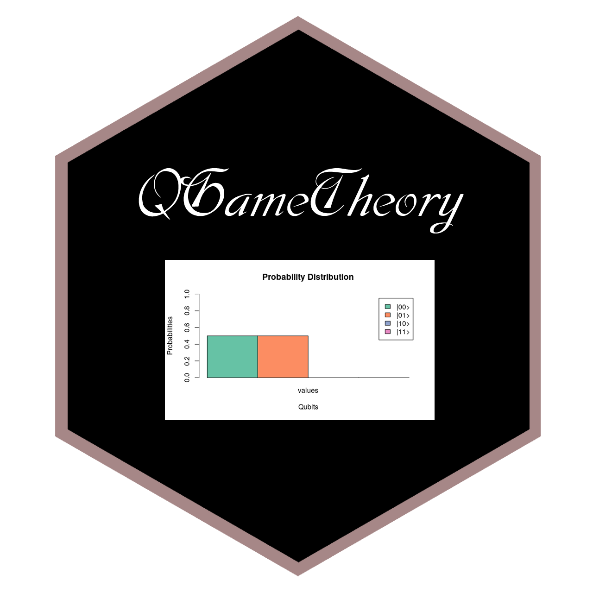

[](https://cran.r-project.org/package=QGameTheory)
[](https://cran.r-project.org/package=QGameTheory)

---
Title: 'QGameTheory: Quantum Game Theory Simulator'

Author: "Indranil Ghosh"

Description: General purpose toolbox for simulating quantum versions of game theoretic models. Quantum versions of models that have been handeled are: Penny Flip Game, Prisoner's Dilemma, Two Person Duel, Battle of the Sexes, Newcomb's Paradox, Hawk and Dove Game and Monty Hall Problem.

---

## Installation

The development version of the package can be installed from the github repository:

```{r}
install.packages("devtools")
devtools::install_github("indrag49/QGameTheory")
```
The released version of **QGameTheory** can be installed from CRAN:

```{r}
install.packages("QGameTheory")
```

## Dependencies

*QGameTheory* depends on three more packages:

```{r}
library(dplyr)
library(RColorBrewer)
library(R.utils)
```
## Global Variables

The variables that are required for the quantum game theoretic models, are built by initializing:

```{r}
init()
```
Where an environement has been developed for holding the variables:

```{r}
Q <<- new.env(parent=emptyenv())
```

All the parameters/variables in the environment are made visible by:

```{r}
ls(Q)
```
The simulator has access to maximum six qubits for quantum computations. Qubits |1>, |0110> and |111110> can be simulated as:

```{r}
Q$Q1
Q$Q0110
Q$Q111110
```
This code chunk when run, produces:

```{r}
> Q$Q1
     [,1]
[1,]    0
[2,]    1
> Q$Q0110
      [,1]
 [1,]    0
 [2,]    0
 [3,]    0
 [4,]    0
 [5,]    0
 [6,]    0
 [7,]    1
 [8,]    0
 [9,]    0
[10,]    0
[11,]    0
[12,]    0
[13,]    0
[14,]    0
[15,]    0
[16,]    0
> Q$Q111110
      [,1]
 [1,]    0
 [2,]    0
 [3,]    0
 [4,]    0
 [5,]    0
 [6,]    0
 [7,]    0
 [8,]    0
 [9,]    0
[10,]    0
[11,]    0
[12,]    0
[13,]    0
[14,]    0
[15,]    0
[16,]    0
[17,]    0
[18,]    0
[19,]    0
[20,]    0
[21,]    0
[22,]    0
[23,]    0
[24,]    0
[25,]    0
[26,]    0
[27,]    0
[28,]    0
[29,]    0
[30,]    0
[31,]    0
[32,]    0
[33,]    0
[34,]    0
[35,]    0
[36,]    0
[37,]    0
[38,]    0
[39,]    0
[40,]    0
[41,]    0
[42,]    0
[43,]    0
[44,]    0
[45,]    0
[46,]    0
[47,]    0
[48,]    0
[49,]    0
[50,]    0
[51,]    0
[52,]    0
[53,]    0
[54,]    0
[55,]    0
[56,]    0
[57,]    0
[58,]    0
[59,]    0
[60,]    0
[61,]    0
[62,]    0
[63,]    1
[64,]    0
```
The identity matrix:

```{r}
> Q$I2
     [,1] [,2]
[1,]    1    0
[2,]    0    1
```
The Pauli-X, Pauli-Y and the Pauli-Z matrix:

```{r}
> sigmaX(Q$I2)
     [,1] [,2]
[1,]    0    1
[2,]    1    0
> sigmaY(Q$I2)
     [,1] [,2]
[1,] 0+0i 0-1i
[2,] 0+1i 0+0i
> sigmaZ(Q$I2)
     [,1] [,2]
[1,]    1    0
[2,]    0   -1
```

The Hadamard Gate:

```{r}
> Hadamard(Q$I2)
          [,1]       [,2]
[1,] 0.7071068  0.7071068
[2,] 0.7071068 -0.7071068
```
The application of Pauli-X gate on |0> and on |1>, i.e, the spin flip operations on qubits, can be simulated in the following way:

```{r}
> sigmaX(Q$Q0)
     [,1]
[1,]    0
[2,]    1
> sigmaX(Q$Q1)
     [,1]
[1,]    1
[2,]    0
```
There are other important quantum gates like: CNOT, Fredkin, Toffoli, T, Phase, Rx, etc.

```{r}
> CNOT(Q$I4)
     [,1] [,2] [,3] [,4]
[1,]    1    0    0    0
[2,]    0    1    0    0
[3,]    0    0    0    1
[4,]    0    0    1    0
> CNOT(Q$Q11)
     [,1]
[1,]    0
[2,]    0
[3,]    1
[4,]    0
> Fredkin(Q$Q110)
     [,1]
[1,]    0
[2,]    0
[3,]    0
[4,]    0
[5,]    0
[6,]    1
[7,]    0
[8,]    0
> Toffoli(Q$Q010)
     [,1]
[1,]    0
[2,]    0
[3,]    1
[4,]    0
[5,]    0
[6,]    0
[7,]    0
[8,]    0
> T(Q$Q_minus)
                [,1]
[1,]  0.7071068+0.0i
[2,] -0.5000000-0.5i
> Phase(Q$I2)
     [,1] [,2]
[1,] 1+0i 0+0i
[2,] 0+0i 0+1i
> Phase(Q$Q_plus)
                     [,1]
[1,] 0.7071068+0.0000000i
[2,] 0.0000000+0.7071068i
> Rx(Q$Q1, pi/3)
                    [,1]
[1,] 0.9659258+0.000000i
[2,] 0.0000000-0.258819i
```
One can prepare on of the 4 Bell states by using:

```{r}
> Bell(Q$Q0, Q$Q1)
          [,1]
[1,] 0.0000000
[2,] 0.7071068
[3,] 0.7071068
[4,] 0.0000000
> Bell(Q$Q1, Q$Q1)
           [,1]
[1,]  0.0000000
[2,]  0.7071068
[3,] -0.7071068
[4,]  0.0000000
```

The **Quantum Fourier Transform** for a given state |y> is simulated by:

```{r}
> QFT(4)
              [,1]
[1,]  0.3535534+0i
[2,] -0.3535534+0i
[3,]  0.3535534-0i
[4,] -0.3535534+0i
[5,]  0.3535534-0i
[6,] -0.3535534+0i
[7,]  0.3535534-0i
[8,] -0.3535534+0i
```

Finally for preparing and measuring an arbitrary quantum state,

```{r}
> sigma_x <- sigmaX(Q$I2)
> U <- (kronecker(Q$I2, Q$I2)+1i*kronecker(sigma_x, sigma_x))/sqrt(2)
> Psi <- U %*% Q$Q00
> Psi
                     [,1]
[1,] 0.7071068+0.0000000i
[2,] 0.0000000+0.0000000i
[3,] 0.0000000+0.0000000i
[4,] 0.0000000+0.7071068i
> QMeasure(Psi)
```

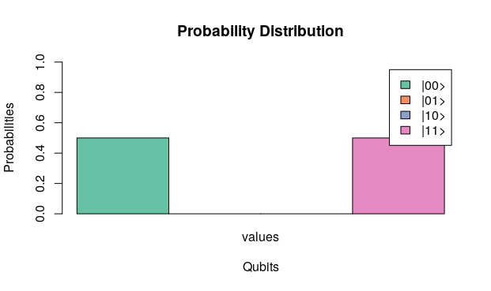

## Game Theory Concepts

The **Iterated Deletion of Strictly Dominated Strategies** algorithm is simulated by taking in the payoff matrices of two players from a two-person game:

```{r}
> P1 <- matrix(c(8, 0, 3, 3, 2, 4, 2, 1, 3), ncol=3, byrow=TRUE)
> P2 <- matrix(c(6, 9, 8, 2, 1, 3, 8, 5, 1), ncol=3, byrow=TRUE)
> IDSDS(P1, P2)
[[1]]
     [,1]
[1,]    4

[[2]]
     [,1]
[1,]    3
```

The **NASH** equilibrium of the payoff matrix of a two person game is computed similary in the following way:

```{r}
> NASH(P1, P2)
Joining, by = c("V1", "V2")
  V1 V2
1  2  3
```
This generates the indices of the cell corresponding to the NASH equilibrium.

## Quantum Game Theory Models

### Quantum Penny Flip

For the game tree mentioned below:

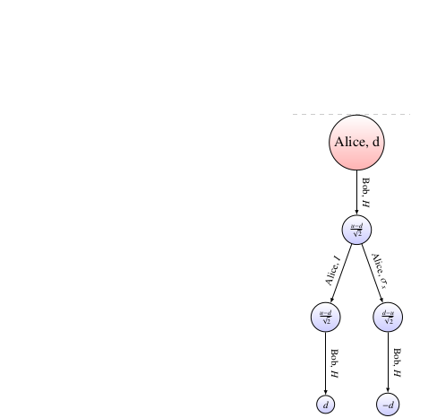

The simulation codes go in the following way:

```{r}
> psi <- (Q$Q0+Q$Q1)/sqrt(2)
> S1 <- sigmaX(Q$I2)
> S2 <- Q$I2
> H <- Hadamard(Q$I2)
> SA <- list(S1, S2)
> SB <- list(H)
> QPennyFlip(psi,SA,SB)
```
It produces the plot:

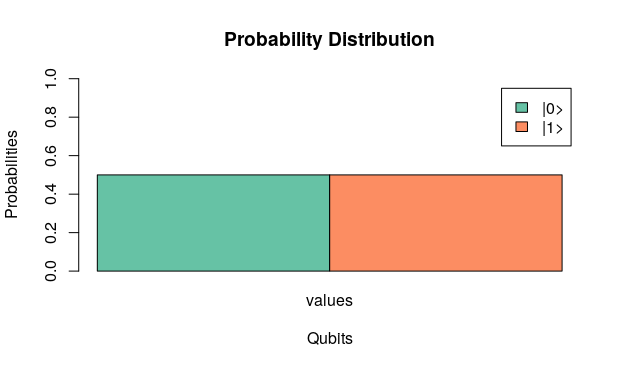

### Quantum Prisoner's Dilemma

One instance of the Quantum Prisoner's Dilemma game can be simulated first by providing the strategies played by both Alice and Bob along with the payoffs *w, x, y, z* available to them corresponding to their choices. The payoffs follow, *z>w>x>y*. 

```{r}
> QPD(Hadamard(Q$I2), sigmaZ(Q$I2), 3, 1, 0, 5)
[1] 1.5 4.0
```

It also generates the plot:

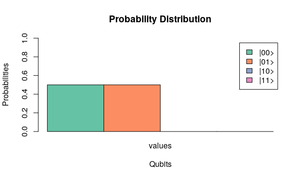

The payoff matrix of the **Quantum Prisoner's Dilemma** for both the players can be constructed:

```{r}
> moves <- list(Q$I2, sigmaX(Q$I2), Hadamard(Q$I2), sigmaZ(Q$I2))
> PayoffMatrix_QPD(moves, 3, 1, 0, 5)
[[1]]
     [,1] [,2] [,3] [,4]
[1,]    3    0 0.50  1.0
[2,]    5    1 0.50  0.0
[3,]    3    3 2.25  1.5
[4,]    1    5 4.00  3.0

[[2]]
     [,1] [,2] [,3] [,4]
[1,]  3.0  5.0 3.00    1
[2,]  0.0  1.0 3.00    5
[3,]  0.5  0.5 2.25    4
[4,]  1.0  0.0 1.50    3
```

The above code also generates all the sixteen possible combinations of plots. Analysing, it is noticed that the quntum version helps us escape the so called dilemma in the classical Prisoner's dilemma game. One next uses the **IDSDS** algorithm to find the **strictly dominant strategy equilibrium**. The **NASH** equilibrium is also calculated by the above codes. It can be seen that both of them give the same result and the equilibrium is Pareto Optimum too.

### Quantum Two Person Duel

Simulation is carried out to calculate the expected payoffs to Alice and Bob for the following three cases:

1) The game is continued for 'n' rounds and none of the players shoots at the air.

2) The game is continued for 2 rounds and Alice shoots at the air in her second round.

3) The game is continued for 2 rounds and Bob shoots at the air in her second round.

```{r}
> Qs <- (Q$Q0+Q$Q1)/sqrt(2)
> Psi <- kronecker(Qs, Qs)
> QDuels_Alice_payoffs(Psi, 5, 0.666666, 0.5, 0, 0, 0.2, 0.7)
[1] 0.2087876 0.3281732 0.4894636
> QDuels_Bob_payoffs(Psi, 5, 0.666666, 0.5, 0, 0, 0.2, 0.7)
[1] 0.7912124 0.6718268 0.5105364
```

Four plotting functions are available to simulate the corresponding results:

1) For plotting Alice's and Bob's expected payoffs as functions of 'alpha1' and 'alpha2':

```{r}
QDuelsPlot1(Psi, 5, 0.66666, 0.5, 0.2, 0.7)
```

<p float="left">
  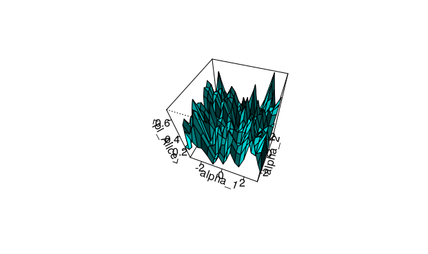
  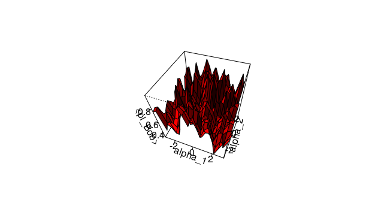 
</p>

2) For plotting Alice's and Bob's expected payoffs as functions of the number of rounds 'n' played in a repeated quantum duel

```{r}
QDuelsPlot2(Psi, 5, 0.666666, 0.5, 0, 0, 0.2, 0.7)
```
<p float="left">
  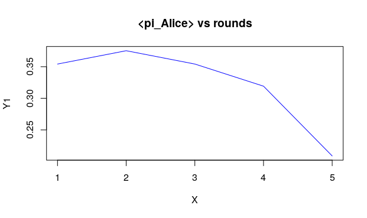
  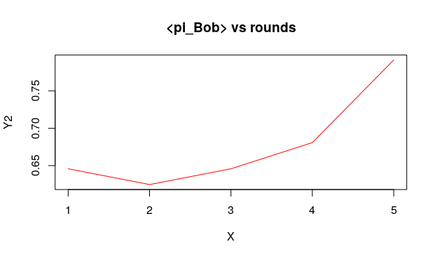 
</p>

3) For plotting the improvement in Alice's expected payoff as a function of 'a' and 'b', if Alice chooses to fire at the air in her second shot, in a two round game

```{r}
QDuelsPlot3(Psi, 0, 0)
```

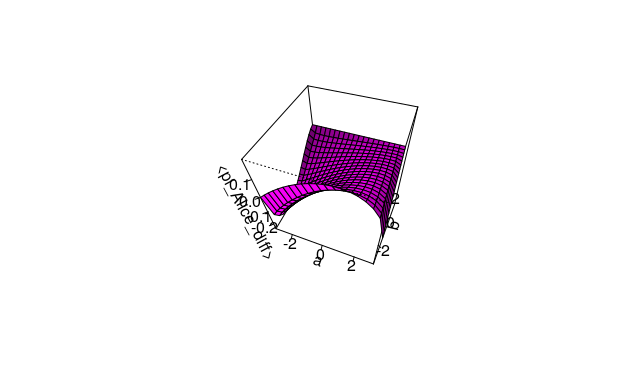

4) For plotting the improvement in Bob's expected payoff as a function of 'a' and 'b', if Bob chooses to fire at the air in her second shot, in a two round game

```{r}
QDuelsPlot4(Psi, 0, 0)
```

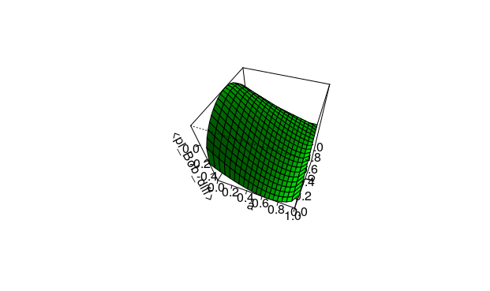

### Quantum Battle of the Sexes

One instance for the **Quantum Battle of the Sexes** can be computed for a particular set of probability values:

```{r}
> moves <- list(Q$I2, sigmaX(Q$I2))
> QBOS(0, 1, moves, 5, 3, 1)
[1] 1.875 2.375
```
The payoff matrix for the quantum game consisting of all the possible combinations of the probabilities can also be constructed:

```{r}
> PayoffMatrix_QBOS(moves, 5, 3, 1)
[[1]]
      [,1]  [,2]
[1,] 2.875 1.875
[2,] 2.375 2.875

[[2]]
      [,1]  [,2]
[1,] 2.875 2.375
[2,] 1.875 2.875
```

### Quantum Newcomb's Paradox

The quantum version of the Newcomb's Paradox can be simulated by taking in the choice of the qubit |0> or |1> by the supercomputer 'Omega' and the probability with which Alice plays the spin flip operator as the input parameters.

```{r}
> QNewcomb(Q$Q1, 0)
     [,1]
[1,]    0
[2,]    0
[3,]    0
[4,]    1
```
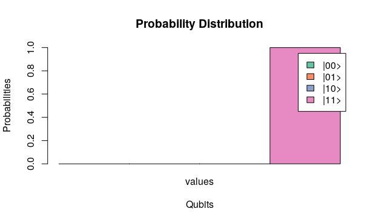

### Quantum Hawk and Dove

One instance of the **Quantum Hawk and Dove** game can be simulated for a particular set of probability values:

```{r}
> moves <- list(Q$I2, sigmaX(Q$I2))
> QHawkDove(0, 1, moves, 50, -100, -10)
[1] 18.75 18.75
```

The payoff matrix for the quantum game consisting of all the possible combinations of the probabilities can also be constructed:

```{r}
> PayoffMatrix_QHawkDove(moves, 50, -100, -10)
[[1]]
         [,1]    [,2]
[1,] 15.78125 21.9375
[2,] 24.53125 28.4375

[[2]]
         [,1]    [,2]
[1,] 28.28125 21.9375
[2,] 24.53125 15.9375
```

### Quantum Monty Hall Problem

The qutrits required for this problem can be constructed in the following way:

```{r}
> Q$Qt0
     [,1]
[1,]    1
[2,]    0
[3,]    0
> Q$Qt1
     [,1]
[1,]    0
[2,]    1
[3,]    0
> Q$Qt2
     [,1]
[1,]    0
[2,]    0
[3,]    1
```

Some SU(3) matrices:

```{r}
> Q$Identity3
     [,1] [,2] [,3]
[1,]    1    0    0
[2,]    0    1    0
[3,]    0    0    1
> Q$Hhat
                      [,1]                  [,2]                 [,3]
[1,]  0.7071068+0.0000000i  0.5000000+0.0000000i 0.5000000+0.0000000i
[2,] -0.5000000+0.0000000i  0.5303301-0.4677072i 0.1767767+0.4677072i
[3,] -0.1767767-0.4677072i -0.3750000+0.3307189i 0.6250000+0.3307189i
```

A quantum state is prepared first from the qutrits:

```{r}
> Psi_in <- kronecker(Q$Qt0, (Q$Qt00+Q$Qt11+Q$Qt22)/sqrt(3))
> Psi
     [,1]
[1,]  0.5
[2,]  0.5
[3,]  0.5
[4,]  0.5
```

The **Quantum Monty Hall** problem, next, is simulated in the following way:

```{r}
> QMontyHall(Psi_in, pi/4, Q$Identity3, Q$Hhat)
[1] 0.125 0.875
```

It returns the expected payoffs to Alice and Bob after the end of the game.

## Miscellaneous functions

Some of the functions that are required for the analyses are:

### row_count()

The above function calculates the number of rows in a matrix or a vector

```{r}
> row_count(Q$Q01)
[1] 4
> row_count(Q$I8)
[1] 8
```

### col_count()

The above function calculates the number of columns in a matrix or a vector

```{r}
> col_count(Q$Q01)
[1] 1
> col_count(Q$I8)
[1] 8
```

### levi_civita()

Calculates the Levi-Civita function for the integers: 0, 1 and 2

```{r}
> levi_civita(0, 2, 1)
[1] -1
> levi_civita(1, 2, 0)
[1] 1
> levi_civita(1, 2, 1)
[1] 0
```

---

Logo designed by Manash Kashyap
